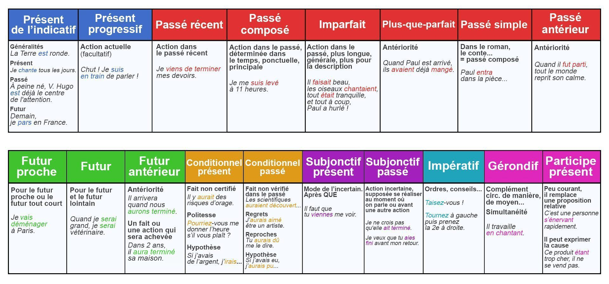

# Conjugaison

La **conjugaison** est l'action de conjuguer un verbe. En effet, dans la langue française, le verbe change de forme avec *le mode*, *le temps*, *la personne* et *le nombre*.

Le **mode** est un trait grammatical qui dénote la manière dont le verbe exprime le fait, qu'il soit état ou action.

En français sept modes verbaux sont employés :

- quatre modes personnels, qui se conjuguent : indicatif, conditionnel, subjonctif et impératif.

- trois modes impersonnels, qui ne se conjuguent pas : infinitif, participe et gérondif.

- [Conjugaison](#conjugaison)
  - [Mode indicatif](#mode-indicatif)
    - [Présent](#présent)
    - [Futur simple](#futur-simple)
    - [Futur antérieur](#futur-antérieur)
  - [Futur proche](#futur-proche)
  - [Mode conditionnel](#mode-conditionnel)
    - [Conditionnel présent](#conditionnel-présent)
    - [Conditionnel passé](#conditionnel-passé)
  - [Imparfait](#imparfait)
  - [Passé antérieur](#passé-antérieur)
  - [Passé composé](#passé-composé)
  - [Passé récent](#passé-récent)
  - [Passé simple](#passé-simple)
  - [Plus-que-parfait](#plus-que-parfait)
  - [Présent progressif](#présent-progressif)
  - [Subjonctif](#subjonctif)
    - [Subjonctif imparfait](#subjonctif-imparfait)
    - [Subjonctif passé](#subjonctif-passé)
    - [Subjonctif présent](#subjonctif-présent)
  - [Table](#table)

## Mode indicatif

### Présent

Formation : les terminaisons des verbes varient selon le groupe auquel appartient le verbe :

<table>
    <tr>
        <td></td>
        <td colspan="2"><b>I groupe</b></td>
        <td colspan="2"><b>II groupe</b></td>
    </tr>
    <tr>
        <td>je / j'</td>
        <td><b>-e</b></td>
        <td>aime</td>
        <td><b>-is</b</b></td>
        <td>finis</td>
    </tr>
    <tr>
        <td>tu</td>
        <td><b>-es</b></td>
        <td>aimes</td>
        <td><b>-is</b></td>
        <td>finis</td>
    </tr>
    <tr>
        <td>il / elle / on</td>
        <td><b>-e</b></td>
        <td>aime</td>
        <td><b>-it</b></td>
        <td>finit</td>
    </tr>
    <tr>
        <td>nous</td>
        <td><b>-ons</b></td>
        <td>aimons</td>
        <td><b>-issons</b></td>
        <td>finissons</td>
    </tr>
    <tr>
        <td>vous</td>
        <td><b>-ez</b></td>
        <td>aimez</td>
        <td><b>-issez</b></td>
        <td>finissez</td>
    </tr>
    <tr>
        <td>ils / elles</td>
        <td><b>-ent</b></td>
        <td>aiment</td>
        <td><b>-issent</b></td>
        <td>finissent</td>
    </tr>
</table>

Les verbes du III groupe ont 3 modèles de terminaisons :

<table>
    <tr>
        <td></td>
        <td colspan="2"><b>générique</b></td>
        <td colspan="2"><b>-dre (sauf -oindre)</b></td>
        <td colspan="2"><b>pouvoir valoir vouloir</b></td>
    </tr>
    <tr>
        <td>je / j'</td>
        <td><b>-s</b></td>
        <td>mets</td>
        <td><b>-ds</b</b></td>
        <td>prends</td>
        <td><b>-x</b</b></td>
        <td>peux</td>
    </tr>
    <tr>
        <td>tu</td>
        <td><b>-s</b></td>
        <td>mets</td>
        <td><b>-ds</b></td>
        <td>prends</td>
        <td><b>-x</b></td>
        <td>peux</td>
    </tr>
    <tr>
        <td>il / elle / on</td>
        <td><b>-t</b></td>
        <td>met</td>
        <td><b>-d</b></td>
        <td>prend</td>
        <td><b>-t</b></td>
        <td>peut</td>
    </tr>
    <tr>
        <td>nous</td>
        <td><b>-ons</b></td>
        <td>mettons</td>
        <td><b>-ons</b></td>
        <td>prenons</td>
        <td><b>-ons</b></td>
        <td>pouvons</td>
    </tr>
    <tr>
        <td>vous</td>
        <td><b>-ez</b></td>
        <td>mettez</td>
        <td><b>-ez</b></td>
        <td>prenez</td>
        <td><b>-ez</b></td>
        <td>pouvez</td>
    </tr>
    <tr>
        <td>ils / elles</td>
        <td><b>-ent</b></td>
        <td>mettent</td>
        <td><b>-ent</b></td>
        <td>prennent</td>
        <td><b>-ent</b></td>
        <td>peuvent</td>
    </tr>
</table>

Les auxiliaries _avoir_, _être_, _faire_ :

|                | avoir | être   | faire   |
| -------------- | ----- | ------ | ------- |
| te / j'        | ai    | suis   | fais    |
| tu             | as    | es     | fais    |
| il / elle / on | a     | est    | fait    |
| nous           | avons | sommes | faisons |
| vous           | avez  | êtes   | faites  |
| ils / elles    | ont   | sont   | font    |

Ce temps exprime un fait ou une action qui se déroule au moment où nous nous exprimons :

```text
Où vas-tu?
Je pars à la plage.
Marc range ses affaires.
```

On peut l'utiliser pour raconter un fait passé « comme si on y était » ou pour exprimer une vérité scientifique ou un fait habituel :

```text
La Terre tourne autour du Soleil.
```

### Futur simple

Formation : les terminaisons du futur simple sont les mêmes pour tous les verbes.

|                |           | I groupe | II groupe | III groupe |
| -------------- | --------- | -------- | --------- | ---------- |
| je / j'        | **-rai**  | aimerai  | finirai   | mettrai    |
| tu             | **-ras**  | aimeras  | finiras   | mettras    |
| il / elle / on | **-ra**   | aimera   | finira    | mettra     |
| nous           | **-rons** | aimerons | finirons  | mettrons   |
| vous           | **-rez**  | aimerez  | finirez   | mettrez    |
| ils / elles    | **-ront** | aimeront | finiront  | mettront   |

Remarques : les verbes en **-eler** ou **-eter** doublent leur consonne ou prennent un accent :

```text
appeler → j'appellerai.
acheter → j'achèterai
```

Les verbes en **-yer** changent le **y** en **i** :

```text
verbe essuyer → j'essuierai
```

Le futur simple exprime un fait ou une action qui se déroulera plus tard, elle n'a pas encore eu lieu au moment où nous nous exprimons :

```text
La semaine prochaine nous partirons en vacances.
```

### Futur antérieur

Formation : *être* ou *avoir* au [futur simple](#futur-simple) auquel + le participe passé du verbe à conjuguer.

Le futur antérieur peut s'employer avec le futur simple pour exprimer une action qui aura lieu avant une seconde action :

```text
Quand tu seras parti, ils fermeront la porte.
```

Le futur antérieur peut s'employer seul pour exprimer un fait ou une action qui se sera achevée à ce moment là :

```text
Dans deux ans, ils auront fini les travaux.
Nous serons partis avant six heures du matin.
Ils auront réalisé un album d'ici lundi.
```

## Futur proche

Formation : le verbe *aller* au [présent de l'indicatif](#présent) + l'infinitif du verbe à conjuguer :

```text
Je vais prendre mon train dans cinq minutes.
Il va prendre son bain.
Nous allons rentrer en début d'après-midi.
```

Le futur proche exprime une action qui va se dérouler très prochainement.

## Mode conditionnel

### Conditionnel présent

Formation : le radical du verbe au [futur simple](#futur-simple) + terminaison de [l'imparfait](#imparfait).

```text
Je voudrais vous rencontrer.
Si je pouvais, je jouerais plus souvent.
Si j'avais de l'argent, je partirais en voyage.
Nous voudrions rentrer plus tôt.
```

Le conditionnel présent peut servir à atténuer une demande.

<table>
    <tr>
        <td></td>
        <td colspan="2"><b>I group</b></td>
        <td colspan="2"><b>autres groupes</b></td>
    </tr>
    <tr>
        <td>je / j'</td>
        <td><b>-erais</b></td>
        <td>aimerais</td>
        <td><b>-rais</b></td>
        <td>finirais</td>
    </tr>
    <tr>
        <td>tu</td>
        <td><b>-erais</b></td>
        <td>aimerais</td>
        <td><b>-rais</b></td>
        <td>finirais</td>
    </tr>
    <tr>
        <td>il / elle / on</td>
        <td><b>-erait</b></td>
        <td>aimerait</td>
        <td><b>-rait</b></td>
        <td>finirait</td>
    </tr>
    <tr>
        <td>nous</td>
        <td><b>-erions</b></td>
        <td>aimerions</td>
        <td><b>-rions</b></td>
        <td>finirions</td>
    </tr>
    <tr>
        <td>vous</td>
        <td><b>-eriez</b></td>
        <td>aimeriez</td>
        <td><b>-riez</b></td>
        <td>finiriez</td>
    </tr>
    <tr>
        <td>ils / elles</td>
        <td><b>-eraient</b></td>
        <td>aimeraient</td>
        <td><b>-raient</b></td>
        <td>finiraient</td>
    </tr>
</table>

### Conditionnel passé

Formation : _être_ ou _avoir_ au [conditionnel présent](#conditionnel-présent) + le [participe passé](participes.md#participe-passé) du verbe à conjuguer.

```text
Tu aurais pu nous le dire.
Il aurait voulu devenir avocat.
Si j'avais de l'argent, je serais partie en voyage.
Nous aurions voulu rentrer plus tôt.
```

Le conditionnel passé peut servir à exprimer un reproche ou un regret.

## Imparfait

Formations : le radical du verbe à la première personne du pluriel au présent + la terminaison de [l'imparfait](#imparfait).

|                |            | I groupe | II groupe   | III groupe |
| -------------- | ---------- | -------- | ----------- | ---------- |
| je / j'        | -**ais**   | aimais   | finissais   | mettais    |
| tu             | -**ais**   | aimais   | finissais   | mettais    |
| il / elle / on | -**ait**   | aimait   | finissait   | mettait    |
| nous           | -**ions**  | aimions  | finissions  | mettions   |
| vous           | -**iez**   | aimiez   | finissiez   | mettiez    |
| ils / elles    | -**aient** | aimaient | finissaient | mettaient  |

Formes de certains verbes de troisième groupe :

|                | avoir   | être    |
| -------------- | ------- | ------- |
| je / j'        | avais   | étais   |
| tu             | avais   | étais   |
| il / elle / on | avait   | était   |
| nous           | avions  | étions  |
| vous           | aviez   | étiez   |
| ils / elles    | avaient | étaient |

```text
Quand tu étais enfant, tu étais timide.
Elle occupait un poste dans l'administration.
Le midi, il mangeait dans le parc.
Tous les jours, elle nettoyait les meubles.
```

L'imparfait exprime un fait ou une action qui a déjà eu lieu au moment où nous nous exprimons mais qui peut encore se dérouler. L'imparfait est souvent utilisé pour décrire une scène, un paysage.

## Passé antérieur

Formation : l'auxiliaire _être_ ou _avoir_ au [passé simple](#passé-simple) + [participe passé](../langue/participes.md#participe-passé) du verbe.

```text
Dès qu'il eut fini de parler, il partit.
J'eus été.
Quand il eut fini, il hurla !
```

Le passé antérieur est utilisé le plus souvent avec le passé simple pour exprimer l'antériorité d'une action.

## Passé composé

Formation : l'auxiliaire _être_ ou _avoir_ au [présent de l'indicatif](#présent-de-lindicatif) + le [participe passé](../participes/participe%20passé.md) du verbe à conjuguer.

```text
Nous avons mangé.
Elles sont arrivées.
```

Le passé composé exprime une action ou un fait qui a déjà eu lieu au moment où nous nous exprimons.

## Passé récent

Formation : le verbe _venir_ au [présent de l'indicatif](#présent-de-lindicatif) + « de/d' » + verbe à l'infinitif.

```text
Je viens de téléphoner à ma mère.
Vous venez d'arriver.
Le train vient de partir.
```

Pour insister sur la proximité du passé et du présent, on peut ajouter l'adverbe **juste** :

```text
Le train vient juste de partir.
Vous venez juste de finir votre contrat.
```

Le passé récent exprime une action dans le passé qui est proche du moment où l'on parle.

## Passé simple

Formation : les terminaisons des verbes varient selon le groupe auquel appartient le verbe.

```text
Soudain, le cycliste chuta par terre.
Le Général de Gaulle vécut 80 ans.
L’année dernière, je partis en vacances en France.
```

<table>
    <tr>
        <td></td>
        <td colspan="2"><b>I groupe</b></td>
        <td colspan="2"><b>II groupe</b></td>
    </tr>
    <tr>
        <td>je / j'</td>
        <td><b>-ai</b></td>
        <td>aimai</td>
        <td><b>-is</b</td>
        <td>finis</td>
    </tr>
    <tr>
        <td>tu</td>
        <td><b>-as</b></td>
        <td>aimas</td>
        <td><b>-is</b></td>
        <td>finis</td>
    </tr>
    <tr>
        <td>il / elle / on</td>
        <td><b>-a</b></td>
        <td>aima</td>
        <td><b>-it</b></td>
        <td>finit</td>
    </tr>
    <tr>
        <td>nous</td>
        <td><b>-âmes</b></td>
        <td>aimâmes</td>
        <td><b>-îmes</b></td>
        <td>finîmes</td>
    </tr>
    <tr>
        <td>vous</td>
        <td><b>-âtes</b></td>
        <td>aimâtes</td>
        <td><b>-îtes</b></td>
        <td>finîtes</td>
    </tr>
    <tr>
        <td>ils / elles</td>
        <td><b>-èrent</b></td>
        <td>aimèrent</td>
        <td><b>-irent</b></td>
        <td>finirent</td>
    </tr>
</table>

Les verbes du III groupe ont 3 modèles de terminaisons :

<table>
    <tr>
        <td>Passé simple de l'indicatif</td>
        <td colspan="2"><b>modèle 1</b></td>
        <td colspan="2"><b>modèle 2</b></td>
        <td colspan="2"><b>modèle 3</b></td>
    </tr>
    <tr>
        <td>je / j'</td>
        <td><b>-is</b></td>
        <td>pris</td>
        <td><b>-us</b</td>
        <td>crus</td>
        <td><b>-ins</b</td>
        <td>vins</td>
    </tr>
    <tr>
        <td>tu</td>
        <td><b>-is</b></td>
        <td>pris</td>
        <td><b>-us</b></td>
        <td>crus</td>
        <td><b>-ins</b></td>
        <td>vins</td>
    </tr>
    <tr>
        <td>il / elle / on</td>
        <td><b>-it</b></td>
        <td>prit</td>
        <td><b>-ut</b></td>
        <td>crut</td>
        <td><b>-int</b></td>
        <td>vint</td>
    </tr>
    <tr>
        <td>nous</td>
        <td><b>-îmes</b></td>
        <td>prîmes</td>
        <td><b>-ûmes</b></td>
        <td>crûmes</td>
        <td><b>-înmes</b></td>
        <td>vînmes</td>
    </tr>
    <tr>
        <td>vous</td>
        <td><b>-îtes</b></td>
        <td>prîtes</td>
        <td><b>-ûtes</b></td>
        <td>crûtes</td>
        <td><b>-întes</b></td>
        <td>vîntes</td>
    </tr>
    <tr>
        <td>ils / elles</td>
        <td><b>-irent</b></td>
        <td>prirent</td>
        <td><b>-urent</b></td>
        <td>crurent</td>
        <td><b>-inrent</b></td>
        <td>vinrent</td>
    </tr>
</table>

Les auxiliaires ont une conjugaison qu'il faut maitriser car ils permettent de former [le passé antérieur](#passé-antérieur) de tous les autres verbes :

|                | avoir  | être   |
| -------------- | ------ | ------ |
| te / j'        | eus    | fus    |
| tu             | eus    | fus    |
| il / elle / on | eut    | fut    |
| nous           | eûmes  | fûmes  |
| vous           | eûtes  | fûtes  |
| ils / elles    | eurent | furent |

Le passé simple exprime une action achevée du passé, le plus souvent une action brève.

## Plus-que-parfait

Formations : [l'imparfait](#imparfait) de _avoir_ ou de _être_ + [participe passé](participes.md#participe-passé).

```text
Quand j'avais dîné, j'allais me promener.
```

Formes des verbes _avoir_ et _être_ :

|                | avoir      | être        |
| -------------- | ---------- | ----------- |
| je / j'        | avais eu   | avais été   |
| tu             | avais eu   | avais été   |
| il / elle / on | avait eu   | avait été   |
| nous           | avions eu  | avions été  |
| vous           | aviez eu   | aviez été   |
| ils / elles    | avaient eu | avaient été |

Le plus-que-parfait marque une action passée ayant eu lieu avant une autre également passée quand celle-ci s'exprime à l'imparfait.

## Présent progressif

Formation : l'auxiliaire *être* au [présent de l'indicatif](#présent-de-lindicatif) + *en train de/d* + verbe à l'infinitif.

```text
Je suis en train de travailler.
Nous sommes en train de finir.
```

Le présent progressif exprime une action au présent dans sa durée et sa continuité.

## Subjonctif

### Subjonctif imparfait

### Subjonctif passé

Formation : l'auxiliaire *être* ou *avoir* au [subjonctif présent](#subjonctif-présent) + le participe passé du verbe à conjuguer :

```text
Je ne crois pas qu'elle ait acheté ce véhicule.
Il faut qu'ils soient partis avant midi.
Je doute qu'ils aient écrit ces lettres.
```

Avec les verbes pronominaux on emploie toujours l'auxiliaire *être* :

```text
Je ne crois pas qu'ils se soient lavés.
```

A la voix passive on utilisera l'auxiliaire *être* au subjonctif passé :

```text
Je doute que tu aies été surpris par cette nouvelle.
```

Le subjonctif passé exprime une action incertaine, supposée réalisée au moment où nous nous exprimons.

### Subjonctif présent

Formation : *que* + sujet + verbe au subjonctif.

```text
Je souhaite qu'il vienne en discuter.
Je souhaite que tu sois présent.
Il faut que nous trouvions un refuge.
Je ne pense pas qu'il puisse arriver à l'heure.
Il faut qu'ils partent rapidement. / Je crains qu'il faille abandonner.
```

Les terminaisons des verbes varient selon le groupe auquel appartient le verbe :

<table>
    <tr>
        <td></td>
        <td colspan="2"><b>I groupe + aller</b></td>
        <td colspan="2"><b>II groupe</b></td>
        <td colspan="2"><b>III groupe</b></td>
    </tr>
    <tr>
        <td>je / j'</td>
        <td><b>-e</b></td>
        <td>mange</td>
        <td><b>-isse</b</td>
        <td>finisse</td>
        <td><b>-e</b></td>
        <td>parte</td>
    </tr>
    <tr>
        <td>tu</td>
        <td><b>-es</b></td>
        <td>manges</td>
        <td><b>-isses</b></td>
        <td>finisses</td>
        <td><b>-es</b></td>
        <td>partes</td>
    </tr>
    <tr>
        <td>il / elle / on</td>
        <td><b>-e</b></td>
        <td>mange</td>
        <td><b>-isse</b></td>
        <td>finisse</td>
        <td><b>-e</b></td>
        <td>parte</td>
    </tr>
    <tr>
        <td>nous</td>
        <td><b>-ions</b></td>
        <td>mangions</td>
        <td><b>-issons</b></td>
        <td>finissions</td>
        <td><b>-ions</b></td>
        <td>partions</td>
    </tr>
    <tr>
        <td>vous</td>
        <td><b>-iez</b></td>
        <td>mangiez</td>
        <td><b>-issiez</b></td>
        <td>finissiez</td>
        <td><b>-iez</b></td>
        <td>partiez</td>
    </tr>
    <tr>
        <td>ils / elles</td>
        <td><b>-ent</b></td>
        <td>mangent</td>
        <td><b>-issent</b></td>
        <td>finissent</td>
        <td><b>-ent</b></td>
        <td>partent</td>
    </tr>
</table>

Formes des verbes _être_ et _avoir_ :

|               | avoir | être   |
| ------------- | ----- | ------ |
| je / j'       | aie   | sois   |
| tu            | aies  | sois   |
| il / elle /on | ait   | soit   |
| nous          | ayons | soyons |
| vous          | ayez  | soyez  |
| ils / elles   | aient | soient |

Le subjonctif présent exprime une action incertaine, non réalisée au moment où nous nous exprimons.

On n'utilise pas le subjonctif après n'importe quel verbe. On utilise le subjonctif après un verbe qui exprime :

| Exprime              | Example                                                    |
| -------------------- | ---------------------------------------------------------- |
| Un souhait           | J'aimerais que vous compreniez l'utilisation du subjonctif |
| Une volonté          | Je veux que mes parents soient fiers de moi                |
| Une obligation       | Il faut que tu viennes                                     |
| Un ordre             | J'exige que vous parliez français                          |
| Une émotion          | Je suis heureuse qu'il fasse beau                          |
| Une opinion négative | Je ne pense pas que le français soit difficile             |
| Un doute             | Je doute qu'il ait réussi son examen                       |
| Une possibilité      | Il se peut qu'il pleuve                                    |
| Une nécessité        | Il est nécessaire que tu prennes de l'argent               |

## Table


