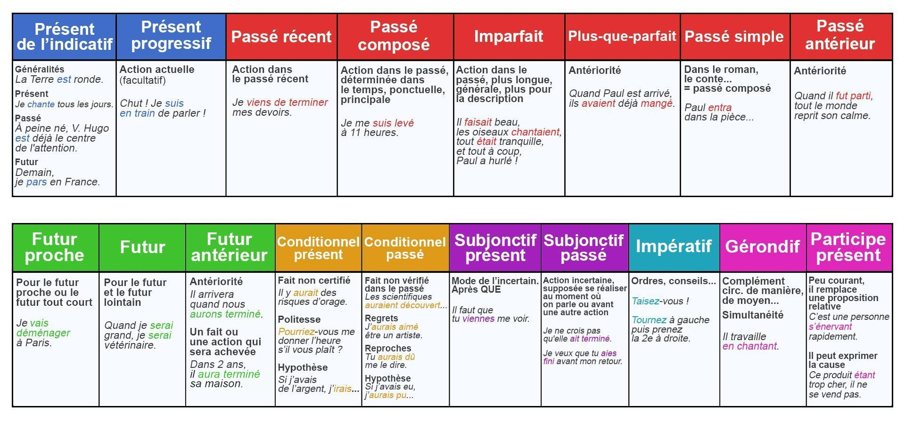

# Conjugaison

La **conjugaison** est l'action de conjuguer un verbe. En effet, dans la langue française, le verbe change de forme avec *le mode*, *le temps*, *la personne* et *le nombre*.

Le **mode** est un trait grammatical qui dénote la manière dont le verbe exprime le fait, qu'il soit état ou action.

Il y a sept modes verbaux en français, qui appartiennent à deux groupes :

- **les modes personnels** : ils sont introduits par un pronom personnel, je, tu, il etc. :
  - l'indicatif
  - le conditionnel
  - le subjonctif
  - l'impératif
- **les modes impersonnels** : tous les modes n'ayant pas de pronom personnel :
  - l'infinitif
  - le participe
  - le gérondif

Les modes personnels sont au nombre de quatre :

- L'indicatif exprime des actions et des vérités générales.
- Le subjonctif exprime un souhait, une volonté ou un conseil.
- Le conditionnel exprime une condition.
- L'impératif exprime un ordre.

Certaines grammaires tendent à rattacher le conditionnel à l'indicatif et ne le considèrent pas comme un mode à part entière. C'est vrai que sur la forme et le sens, on peut le rapprocher de l'indicatif. Pour des raisons de tradition, nous présentons le conditionnel comme un mode à part entière.

Quant à l'impératif, il comporte une flexion de personne incomplète car il ne se forme pas avec toutes les personnes. "je", "il" et "ils" sont les grands absents de l'impératif.

Les modes impersonnels ne se conjuguent pas. Ils permettent de conférer au verbe des emplois réservés à d'autres classes tels que les noms ou les adjectifs.

## Sommaire

- [Conjugaison](#conjugaison)
  - [Sommaire](#sommaire)
  - [Modes personnels](#modes-personnels)
    - [Mode indicatif](#mode-indicatif)
      - [Présent](#présent)
      - [Présent progressif](#présent-progressif)
      - [Imparfait](#imparfait)
      - [Passé récent](#passé-récent)
      - [Passé composé](#passé-composé)
      - [Plus-que-parfait](#plus-que-parfait)
      - [Passé simple](#passé-simple)
      - [Passé antérieur](#passé-antérieur)
      - [Futur simple](#futur-simple)
      - [Futur antérieur](#futur-antérieur)
      - [Futur proche](#futur-proche)
    - [Mode conditionnel](#mode-conditionnel)
      - [Conditionnel présent](#conditionnel-présent)
      - [Conditionnel passé](#conditionnel-passé)
    - [Mode subjonctif](#mode-subjonctif)
      - [Subjonctif présent](#subjonctif-présent)
      - [Subjonctif passé](#subjonctif-passé)
      - [Subjonctif imparfait](#subjonctif-imparfait)
      - [Subjonctif plus-que-parfait](#subjonctif-plus-que-parfait)
    - [Mode impératif](#mode-impératif)
      - [Impératif présent](#impératif-présent)
      - [Impératif passé](#impératif-passé)
  - [Modes impersonnel](#modes-impersonnel)
    - [Mode infinitif](#mode-infinitif)
      - [Infinitif présent](#infinitif-présent)
      - [Infinitif passé](#infinitif-passé)
    - [Mode participe](#mode-participe)
      - [Participe présent](#participe-présent)
      - [Participe passé](#participe-passé)
      - [Participe passé composé](#participe-passé-composé)
    - [Mode gérondif](#mode-gérondif)
      - [Gérondif présent](#gérondif-présent)
      - [Gérondif passé](#gérondif-passé)
  - [Table des langues](#table-des-langues)

## Modes personnels

### Mode indicatif

#### Présent

Formation : les terminaisons des verbes varient selon le groupe auquel appartient le verbe :

<table>
    <tr>
        <td></td>
        <td colspan="2"><b>I groupe</b></td>
        <td colspan="2"><b>II groupe</b></td>
    </tr>
    <tr>
        <td>je / j'</td>
        <td><b>-e</b></td>
        <td>aime</td>
        <td><b>-is</b</b></td>
        <td>finis</td>
    </tr>
    <tr>
        <td>tu</td>
        <td><b>-es</b></td>
        <td>aimes</td>
        <td><b>-is</b></td>
        <td>finis</td>
    </tr>
    <tr>
        <td>il / elle / on</td>
        <td><b>-e</b></td>
        <td>aime</td>
        <td><b>-it</b></td>
        <td>finit</td>
    </tr>
    <tr>
        <td>nous</td>
        <td><b>-ons</b></td>
        <td>aimons</td>
        <td><b>-issons</b></td>
        <td>finissons</td>
    </tr>
    <tr>
        <td>vous</td>
        <td><b>-ez</b></td>
        <td>aimez</td>
        <td><b>-issez</b></td>
        <td>finissez</td>
    </tr>
    <tr>
        <td>ils / elles</td>
        <td><b>-ent</b></td>
        <td>aiment</td>
        <td><b>-issent</b></td>
        <td>finissent</td>
    </tr>
</table>

Les verbes du III groupe ont 3 modèles de terminaisons :

<table>
    <tr>
        <td></td>
        <td colspan="2"><b>générique</b></td>
        <td colspan="2"><b>-dre (sauf -oindre)</b></td>
        <td colspan="2"><b>pouvoir valoir vouloir</b></td>
    </tr>
    <tr>
        <td>je / j'</td>
        <td><b>-s</b></td>
        <td>mets</td>
        <td><b>-ds</b</b></td>
        <td>prends</td>
        <td><b>-x</b</b></td>
        <td>peux</td>
    </tr>
    <tr>
        <td>tu</td>
        <td><b>-s</b></td>
        <td>mets</td>
        <td><b>-ds</b></td>
        <td>prends</td>
        <td><b>-x</b></td>
        <td>peux</td>
    </tr>
    <tr>
        <td>il / elle / on</td>
        <td><b>-t</b></td>
        <td>met</td>
        <td><b>-d</b></td>
        <td>prend</td>
        <td><b>-t</b></td>
        <td>peut</td>
    </tr>
    <tr>
        <td>nous</td>
        <td><b>-ons</b></td>
        <td>mettons</td>
        <td><b>-ons</b></td>
        <td>prenons</td>
        <td><b>-ons</b></td>
        <td>pouvons</td>
    </tr>
    <tr>
        <td>vous</td>
        <td><b>-ez</b></td>
        <td>mettez</td>
        <td><b>-ez</b></td>
        <td>prenez</td>
        <td><b>-ez</b></td>
        <td>pouvez</td>
    </tr>
    <tr>
        <td>ils / elles</td>
        <td><b>-ent</b></td>
        <td>mettent</td>
        <td><b>-ent</b></td>
        <td>prennent</td>
        <td><b>-ent</b></td>
        <td>peuvent</td>
    </tr>
</table>

Les auxiliaries *avoir*, *être*, *faire* :

|                | avoir | être   | faire   |
| -------------- | ----- | ------ | ------- |
| je / j'        | ai    | suis   | fais    |
| tu             | as    | es     | fais    |
| il / elle / on | a     | est    | fait    |
| nous           | avons | sommes | faisons |
| vous           | avez  | êtes   | faites  |
| ils / elles    | ont   | sont   | font    |

Ce temps exprime un fait ou une action qui se déroule au moment où nous nous exprimons :

```text
Où vas-tu?
Je pars à la plage.
Marc range ses affaires.
```

On peut l'utiliser pour raconter un fait passé « comme si on y était » ou pour exprimer une vérité scientifique ou un fait habituel :

```text
La Terre tourne autour du Soleil.
```

#### Présent progressif

Formation : l'auxiliaire *être* au [présent](#présent) + *en train de/d* + verbe à l'[infinitif présent](#infinitif-présent).

```text
Je suis en train de travailler.
Nous sommes en train de finir.
```

Le présent progressif exprime une action au présent dans sa durée et sa continuité.

#### Imparfait

Formation : le radical du verbe à la première personne du pluriel au [présent](#présent) + la terminaison de l'imparfait.

|                |            | I groupe | II groupe   | III groupe |
| -------------- | ---------- | -------- | ----------- | ---------- |
| je / j'        | -**ais**   | aimais   | finissais   | mettais    |
| tu             | -**ais**   | aimais   | finissais   | mettais    |
| il / elle / on | -**ait**   | aimait   | finissait   | mettait    |
| nous           | -**ions**  | aimions  | finissions  | mettions   |
| vous           | -**iez**   | aimiez   | finissiez   | mettiez    |
| ils / elles    | -**aient** | aimaient | finissaient | mettaient  |

Formes de certains verbes de troisième groupe :

|                | avoir   | être    |
| -------------- | ------- | ------- |
| je / j'        | avais   | étais   |
| tu             | avais   | étais   |
| il / elle / on | avait   | était   |
| nous           | avions  | étions  |
| vous           | aviez   | étiez   |
| ils / elles    | avaient | étaient |

```text
Quand tu étais enfant, tu étais timide.
Elle occupait un poste dans l'administration.
Le midi, il mangeait dans le parc.
Tous les jours, elle nettoyait les meubles.
```

L'imparfait exprime un fait ou une action qui a déjà eu lieu au moment où nous nous exprimons mais qui peut encore se dérouler. L'imparfait est souvent utilisé pour décrire une scène, un paysage.

#### Passé récent

Formation : le verbe *venir* au [présent](#présent) + « de/d' » + verbe à l'[infinitif présent](#infinitif-présent).

```text
Je viens de téléphoner à ma mère.
Vous venez d'arriver.
Le train vient de partir.
```

Pour insister sur la proximité du passé et du présent, on peut ajouter l'adverbe *juste* :

```text
Le train vient juste de partir.
Vous venez juste de finir votre contrat.
```

Le passé récent exprime une action dans le passé qui est proche du moment où l'on parle.

#### Passé composé

Formation : l'auxiliaire *être* ou *avoir* au [présent](#présent) + le [participe passé](#participe-passé) du verbe à conjuguer.

```text
Nous avons mangé.
Elles sont arrivées.
```

Le passé composé exprime une action ou un fait qui a déjà eu lieu au moment où nous nous exprimons.

#### Plus-que-parfait

Formation : [l'imparfait](#imparfait) de *avoir* ou de *être* + le [participe passé](#participe-passé).

```text
Quand j'avais dîné, j'allais me promener.
```

Formes des verbes *avoir* et *être* :

|                | avoir      | être        |
| -------------- | ---------- | ----------- |
| je / j'        | avais eu   | avais été   |
| tu             | avais eu   | avais été   |
| il / elle / on | avait eu   | avait été   |
| nous           | avions eu  | avions été  |
| vous           | aviez eu   | aviez été   |
| ils / elles    | avaient eu | avaient été |

Le plus-que-parfait marque une action passée ayant eu lieu avant une autre également passée quand celle-ci s'exprime à l'imparfait.

#### Passé simple

Formation : les terminaisons des verbes varient selon le groupe auquel appartient le verbe.

```text
Soudain, le cycliste chuta par terre.
Le Général de Gaulle vécut 80 ans.
L’année dernière, je partis en vacances en France.
```

<table>
    <tr>
        <td></td>
        <td colspan="2"><b>I groupe</b></td>
        <td colspan="2"><b>II groupe</b></td>
    </tr>
    <tr>
        <td>je / j'</td>
        <td><b>-ai</b></td>
        <td>aimai</td>
        <td><b>-is</b</td>
        <td>finis</td>
    </tr>
    <tr>
        <td>tu</td>
        <td><b>-as</b></td>
        <td>aimas</td>
        <td><b>-is</b></td>
        <td>finis</td>
    </tr>
    <tr>
        <td>il / elle / on</td>
        <td><b>-a</b></td>
        <td>aima</td>
        <td><b>-it</b></td>
        <td>finit</td>
    </tr>
    <tr>
        <td>nous</td>
        <td><b>-âmes</b></td>
        <td>aimâmes</td>
        <td><b>-îmes</b></td>
        <td>finîmes</td>
    </tr>
    <tr>
        <td>vous</td>
        <td><b>-âtes</b></td>
        <td>aimâtes</td>
        <td><b>-îtes</b></td>
        <td>finîtes</td>
    </tr>
    <tr>
        <td>ils / elles</td>
        <td><b>-èrent</b></td>
        <td>aimèrent</td>
        <td><b>-irent</b></td>
        <td>finirent</td>
    </tr>
</table>

Les verbes du III groupe ont 3 modèles de terminaisons :

<table>
    <tr>
        <td>Passé simple de l'indicatif</td>
        <td colspan="2"><b>modèle 1</b></td>
        <td colspan="2"><b>modèle 2</b></td>
        <td colspan="2"><b>modèle 3</b></td>
    </tr>
    <tr>
        <td>je / j'</td>
        <td><b>-is</b></td>
        <td>pris</td>
        <td><b>-us</b</td>
        <td>crus</td>
        <td><b>-ins</b</td>
        <td>vins</td>
    </tr>
    <tr>
        <td>tu</td>
        <td><b>-is</b></td>
        <td>pris</td>
        <td><b>-us</b></td>
        <td>crus</td>
        <td><b>-ins</b></td>
        <td>vins</td>
    </tr>
    <tr>
        <td>il / elle / on</td>
        <td><b>-it</b></td>
        <td>prit</td>
        <td><b>-ut</b></td>
        <td>crut</td>
        <td><b>-int</b></td>
        <td>vint</td>
    </tr>
    <tr>
        <td>nous</td>
        <td><b>-îmes</b></td>
        <td>prîmes</td>
        <td><b>-ûmes</b></td>
        <td>crûmes</td>
        <td><b>-înmes</b></td>
        <td>vînmes</td>
    </tr>
    <tr>
        <td>vous</td>
        <td><b>-îtes</b></td>
        <td>prîtes</td>
        <td><b>-ûtes</b></td>
        <td>crûtes</td>
        <td><b>-întes</b></td>
        <td>vîntes</td>
    </tr>
    <tr>
        <td>ils / elles</td>
        <td><b>-irent</b></td>
        <td>prirent</td>
        <td><b>-urent</b></td>
        <td>crurent</td>
        <td><b>-inrent</b></td>
        <td>vinrent</td>
    </tr>
</table>

Les auxiliaires ont une conjugaison qu'il faut maîtriser car ils permettent de former le [passé antérieur](#passé-antérieur) de tous les autres verbes :

|                | avoir  | être   |
| -------------- | ------ | ------ |
| je / j'        | eus    | fus    |
| tu             | eus    | fus    |
| il / elle / on | eut    | fut    |
| nous           | eûmes  | fûmes  |
| vous           | eûtes  | fûtes  |
| ils / elles    | eurent | furent |

Le passé simple exprime une action achevée du passé, le plus souvent une action brève.

#### Passé antérieur

Formation : l'auxiliaire *être* ou *avoir* au [passé simple](#passé-simple) + le [participe passé](#participe-passé) du verbe.

```text
Dès qu'il eut fini de parler, il partit.
J'eus été.
Quand il eut fini, il hurla !
```

Le passé antérieur est utilisé le plus souvent avec le passé simple pour exprimer l'antériorité d'une action.

#### Futur simple

Formation : les terminaisons du futur simple sont les mêmes pour tous les verbes.

|                |           | I groupe | II groupe | III groupe |
| -------------- | --------- | -------- | --------- | ---------- |
| je / j'        | **-rai**  | aimerai  | finirai   | mettrai    |
| tu             | **-ras**  | aimeras  | finiras   | mettras    |
| il / elle / on | **-ra**   | aimera   | finira    | mettra     |
| nous           | **-rons** | aimerons | finirons  | mettrons   |
| vous           | **-rez**  | aimerez  | finirez   | mettrez    |
| ils / elles    | **-ront** | aimeront | finiront  | mettront   |

Remarques : les verbes en **-eler** ou **-eter** doublent leur consonne ou prennent un accent :

```text
appeler → j'appellerai.
acheter → j'achèterai
```

Les verbes en **-yer** changent le **y** en **i** :

```text
verbe essuyer → j'essuierai
```

Le futur simple exprime un fait ou une action qui se déroulera plus tard, elle n'a pas encore eu lieu au moment où nous nous exprimons :

```text
La semaine prochaine nous partirons en vacances.
```

#### Futur antérieur

Formation : *être* ou *avoir* au [futur simple](#futur-simple) + le [participe passé](#participe-passé) du verbe à conjuguer.

Le futur antérieur peut s'employer avec le futur simple pour exprimer une action qui aura lieu avant une seconde action :

```text
Quand tu seras parti, ils fermeront la porte.
```

Le futur antérieur peut s'employer seul pour exprimer un fait ou une action qui se sera achevée à ce moment là :

```text
Dans deux ans, ils auront fini les travaux.
Nous serons partis avant six heures du matin.
Ils auront réalisé un album d'ici lundi.
```

#### Futur proche

Formation : le verbe *aller* au [présent](#présent) + l'[infinitif présent](#infinitif-présent) du verbe à conjuguer :

```text
Je vais prendre mon train dans cinq minutes.
Il va prendre son bain.
Nous allons rentrer en début d'après-midi.
```

Le futur proche exprime une action qui va se dérouler très prochainement.

### Mode conditionnel

#### Conditionnel présent

Formation : le radical du verbe au [futur simple](#futur-simple) + terminaison de [l'imparfait](#imparfait).

```text
Je voudrais vous rencontrer.
Si je pouvais, je jouerais plus souvent.
Si j'avais de l'argent, je partirais en voyage.
Nous voudrions rentrer plus tôt.
```

Le conditionnel présent peut servir à atténuer une demande.

<table>
    <tr>
        <td></td>
        <td colspan="2"><b>I group</b></td>
        <td colspan="2"><b>autres groupes</b></td>
    </tr>
    <tr>
        <td>je / j'</td>
        <td><b>-erais</b></td>
        <td>aimerais</td>
        <td><b>-rais</b></td>
        <td>finirais</td>
    </tr>
    <tr>
        <td>tu</td>
        <td><b>-erais</b></td>
        <td>aimerais</td>
        <td><b>-rais</b></td>
        <td>finirais</td>
    </tr>
    <tr>
        <td>il / elle / on</td>
        <td><b>-erait</b></td>
        <td>aimerait</td>
        <td><b>-rait</b></td>
        <td>finirait</td>
    </tr>
    <tr>
        <td>nous</td>
        <td><b>-erions</b></td>
        <td>aimerions</td>
        <td><b>-rions</b></td>
        <td>finirions</td>
    </tr>
    <tr>
        <td>vous</td>
        <td><b>-eriez</b></td>
        <td>aimeriez</td>
        <td><b>-riez</b></td>
        <td>finiriez</td>
    </tr>
    <tr>
        <td>ils / elles</td>
        <td><b>-eraient</b></td>
        <td>aimeraient</td>
        <td><b>-raient</b></td>
        <td>finiraient</td>
    </tr>
</table>

#### Conditionnel passé

Formation : *être* ou *avoir* au [conditionnel présent](#conditionnel-présent) + le [participe passé](#participe-passé) du verbe à conjuguer.

```text
Tu aurais pu nous le dire.
Il aurait voulu devenir avocat.
Si j'avais de l'argent, je serais partie en voyage.
Nous aurions voulu rentrer plus tôt.
```

Le conditionnel passé peut servir à exprimer un reproche ou un regret.

### Mode subjonctif

#### Subjonctif présent

Formation : *que* + sujet + verbe au subjonctif.

```text
Je souhaite qu'il vienne en discuter.
Je souhaite que tu sois présent.
Il faut que nous trouvions un refuge.
Je ne pense pas qu'il puisse arriver à l'heure.
Il faut qu'ils partent rapidement. / Je crains qu'il faille abandonner.
```

Les terminaisons des verbes varient selon le groupe auquel appartient le verbe :

<table>
    <tr>
        <td></td>
        <td colspan="2"><b>I groupe + aller</b></td>
        <td colspan="2"><b>II groupe</b></td>
        <td colspan="2"><b>III groupe</b></td>
    </tr>
    <tr>
        <td>je / j'</td>
        <td><b>-e</b></td>
        <td>mange</td>
        <td><b>-isse</b</td>
        <td>finisse</td>
        <td><b>-e</b></td>
        <td>parte</td>
    </tr>
    <tr>
        <td>tu</td>
        <td><b>-es</b></td>
        <td>manges</td>
        <td><b>-isses</b></td>
        <td>finisses</td>
        <td><b>-es</b></td>
        <td>partes</td>
    </tr>
    <tr>
        <td>il / elle / on</td>
        <td><b>-e</b></td>
        <td>mange</td>
        <td><b>-isse</b></td>
        <td>finisse</td>
        <td><b>-e</b></td>
        <td>parte</td>
    </tr>
    <tr>
        <td>nous</td>
        <td><b>-ions</b></td>
        <td>mangions</td>
        <td><b>-issons</b></td>
        <td>finissions</td>
        <td><b>-ions</b></td>
        <td>partions</td>
    </tr>
    <tr>
        <td>vous</td>
        <td><b>-iez</b></td>
        <td>mangiez</td>
        <td><b>-issiez</b></td>
        <td>finissiez</td>
        <td><b>-iez</b></td>
        <td>partiez</td>
    </tr>
    <tr>
        <td>ils / elles</td>
        <td><b>-ent</b></td>
        <td>mangent</td>
        <td><b>-issent</b></td>
        <td>finissent</td>
        <td><b>-ent</b></td>
        <td>partent</td>
    </tr>
</table>

Formes des verbes *être* et *avoir* :

|               | avoir | être   |
| ------------- | ----- | ------ |
| je / j'       | aie   | sois   |
| tu            | aies  | sois   |
| il / elle /on | ait   | soit   |
| nous          | ayons | soyons |
| vous          | ayez  | soyez  |
| ils / elles   | aient | soient |

Le subjonctif présent exprime une action incertaine, non réalisée au moment où nous nous exprimons.

On n'utilise pas le subjonctif après n'importe quel verbe. On utilise le subjonctif après un verbe qui exprime :

| Exprime              | Example                                                    |
| -------------------- | ---------------------------------------------------------- |
| Un souhait           | J'aimerais que vous compreniez l'utilisation du subjonctif |
| Une volonté          | Je veux que mes parents soient fiers de moi                |
| Une obligation       | Il faut que tu viennes                                     |
| Un ordre             | J'exige que vous parliez français                          |
| Une émotion          | Je suis heureuse qu'il fasse beau                          |
| Une opinion négative | Je ne pense pas que le français soit difficile             |
| Un doute             | Je doute qu'il ait réussi son examen                       |
| Une possibilité      | Il se peut qu'il pleuve                                    |
| Une nécessité        | Il est nécessaire que tu prennes de l'argent               |

#### Subjonctif passé

Formation : l'auxiliaire *être* ou *avoir* au [subjonctif présent](#subjonctif-présent) + le [participe passé](#participe-passé) du verbe à conjuguer :

```text
Je ne crois pas qu'elle ait acheté ce véhicule.
Il faut qu'ils soient partis avant midi.
Je doute qu'ils aient écrit ces lettres.
```

Avec les verbes pronominaux on emploie toujours l'auxiliaire *être* :

```text
Je ne crois pas qu'ils se soient lavés.
```

A la voix passive on utilisera l'auxiliaire *être* au subjonctif passé :

```text
Je doute que tu aies été surpris par cette nouvelle.
```

Le subjonctif passé exprime une action incertaine, supposée réalisée au moment où nous nous exprimons.

#### Subjonctif imparfait

#### Subjonctif plus-que-parfait

### Mode impératif

#### Impératif présent

#### Impératif passé

## Modes impersonnel

### Mode infinitif

#### Infinitif présent

L'infinitif présent du verbe est sa forme nominale, c'est à dire sans conjugaison — ni personne, ni nombre, ni temps :

```text
Manger ; finir ; prendre ; être ; avoir.
```

Son emploi est très étendu et sa fonction grammaticale très variée. Il sert souvent à utiliser un verbe à la place d'un nom :

```text
Je vais casser les œufs.
Lire est indispensable.
Il espère répondre rapidement.
J'ai un cours à donner.
```

#### Infinitif passé

Formation : l'auxiliaire *être* ou *avoir* à l'[infinitif présent](#infinitif-présent) + le [participe passé](#participe-passé) du verbe à conjuguer qui s'accorde selon les règles d'accord du participe passé :

```text
Après être arrivés, nous avons téléphoné à nos amis.
Nous regrettons d'avoir vendu notre voiture.
```

L'infinitif passé est une forme conjuguée indiquant une notion d'antériorité. Quand il y a deux actions au passé dans une phrase, on utilise l’infinitif passé pour décrire l’action qui se déroule en premier :

```text
Après avoir fermé les volets, Victor monta se coucher.
Je suis désolé de ne pas être venu hier.
```

L’infinitif passé est utilisé pour une action terminée alors que l’[infinitif présent](#infinitif-présent) est employé pour une action en cours ou à venir :

```text
C’est une bonne idée d’aller au cinéma (= nous allons au cinéma maintenant).
C’est une bonne idée d’être allés au cinéma (= nous sommes déjà allés au cinéma).
```

On utilise l’infinitif passé quand le sujet est identique pour les deux actions car le répéter n’est pas naturel :

```text
Je pensais avoir fermé la porte à clef (plutôt que je pensais que j’avais fermé la porte à clef).
```

### Mode participe

#### Participe présent

Le participe présent fonctionne comme un adverbe invariable sauf s'il est employé comme un adjectif, et s'accorde alors en genre et en nombre avec son sujet.

Formation:

**1.** Le participe présent a toujours pour suffixe **-ant** et est invariable :

```text
Ils allaient à l'école en chantant.

Elle allait à l'école en chantant.
```

**2.** L'adjectif verbal est dérivé du participe présent, mais il s'accorde en genre et en nombre avec le nom qu'il qualifie. L'adjectif verbal a pour suffixes **-ant**, **-ants**, **-ante** et **-antes** :

```text
Un jeune homme charmant ; des enfants charmants ; une fillette charmante ; des jeunes femmes charmantes.
```

**3.** Par ailleurs, bien que dérivé du participe présent, l'adjectif verbal peut avoir une écriture différente. Pour la plupart des verbes finissant par **guer** ou **quer**, le **u** est supprimé.

```text
Naviguant (participe présent) devient navigant (adjectif verbal).
```

#### Participe passé

Le **participe passé** est employé avec l'auxiliaire **être** ou **avoir** dans la conjugaison des temps composés, le plus souvent pour exprimer une action passée :

```text
Les bateaux sont rentrés au port.

Nous étions partis ce matin.
```

Il est utilisé dans la construction du [passé composé](#passé-composé), [plus-que-parfait](#plus-que-parfait), [passé antérieur](#passé-antérieur), [futur antérieur](#futur-antérieur) mais aussi dans les temps [conditionnel passé](#conditionnel-passé), [subjonctif passé](#subjonctif-passé) et [subjonctif plus-que-parfait](#subjonctif-plus-que-parfait).

Formation:

Pour construire le participe passé, on rajoute au radical du verbe une terminaison qui dépend du groupe (1er, 2ème ou 3ème) :

<table>
    <tr>
        <th>Terminaisons du participe passé</th>
        <th colspan="2">1er groupe</th>
        <th colspan="2">2e groupe</th>
    </tr>
    <tr>
        <td>Masculin singulier</td>
        <td><b>-é</b></td>
        <td>aimé</td>
        <td><b>-i</b></td>
        <td>fini</td>
    </tr>
    <tr>
        <td>Masculin pluriel</td>
        <td><b>-és</b></td>
        <td>aimés</td>
        <td><b>-is</b></td>
        <td>finis</td>
    </tr>
    <tr>
        <td>Féminin singulier</td>
        <td><b>-ée</b></td>
        <td>aimée</td>
        <td><b>-ie</b></td>
        <td>finie</td>
    </tr>
    <tr>
        <td>Féminin pluriel</td>
        <td><b>-ées</b></td>
        <td>aimées</td>
        <td><b>-ies</b></td>
        <td>finies</td>
    </tr>
</table>

<br>
Les verbes du 3e groupe ont 3 modèles de terminaisons :
<br>
<br>

<table>
    <tr>
        <th>3e groupe</th>
        <th colspan="2">modèle 1</th>
        <th colspan="2">modèle 2</th>
        <th colspan="2">modèle 3</th>
    </tr>
    <tr>
        <td>Masculin singulier</td>
        <td><b>-s</b></td>
        <td>pris</td>
        <td><b>-</b></td>
        <td>suivi / cuit / vu / fait</td>
        <td><b>-us</b></td>
        <td>absous</td>
    </tr>
    <tr>
        <td>Masculin pluriel</td>
        <td><b>-s</b></td>
        <td>pris</td>
        <td><b>-s</b></td>
        <td>suivis / cuits / vus / faits</td>
        <td><b>-us</b></td>
        <td>absous</td>
    </tr>
    <tr>
        <td>Féminin singulier</td>
        <td><b>-se</b></td>
        <td>prise</td>
        <td><b>-e</b></td>
        <td>suivie / cuite / vue / faite</td>
        <td><b>-ute</b></td>
        <td>absoute</td>
    </tr>
    <tr>
        <td>Féminin pluriel</td>
        <td><b>-ses</b></td>
        <td>prises</td>
        <td><b>-es</b></td>
        <td>suivies / cuites / vues / faites</td>
        <td><b>-utes</b></td>
        <td>absoutes</td>
    </tr>
</table>

#### Participe passé composé

TBD <https://la-conjugaison.nouvelobs.com/regles/conjugaison/participe-passe-1.php>

### Mode gérondif

#### Gérondif présent

Le gérondif indique une simultanéité entre deux actions dont le sujet est identique. Il est souvent introduit par la préposition **en**. Il est invariable :

```text
Il rêve en marchant.

C'est en travaillant qu'il a réussi.
```

Formation:

On rajoute la terminaison **ant** à la racine du verbe. Pour les verbes qui changent de racine, on se base sur la racine de la 1ère personne du pluriel de l'indicatif :

```text
trouver → nous trouvons → trouvant
prendre → nous prenons → prenant
finir → finissons → finissant
```

#### Gérondif passé

Le gérondif passé est une forme conjuguée indiquant une notion d'antériorité :

Formation:

C'est une forme composée : on utilise le [participe présent](#participe-présent) l'auxiliaire être (étant) ou avoir (ayant) et on rajoute le [participe passé](#participe-passé) du verbe à conjuguer qui s'accorde selon les règles d'accord du participe passé :

```text
Étant arrivés, nous avons téléphoné à nos amis.

Ayant vendu notre voiture, nous ne pourrons pas venir.
```

## Table des langues


